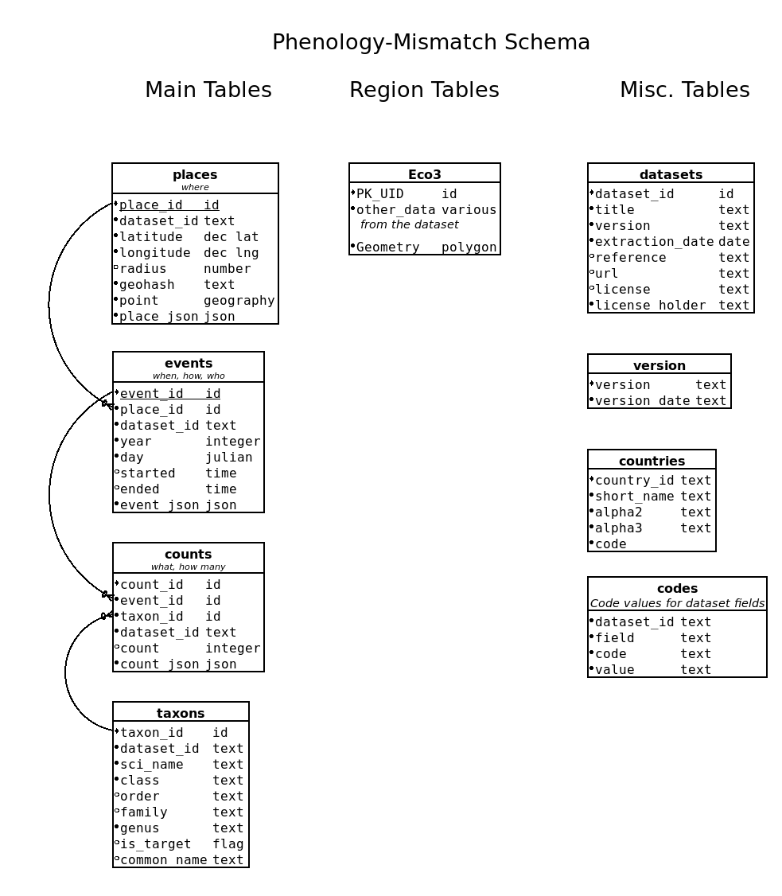

# pheno-mismatch
Causes, consequences, and cross-scale linkages of climate-driven phenological mismatch across three tropic levels

## Repository contribution
This repository contains scripts to help research and outreach efforts. There are other GitHub repositories for this project maintained by the various research labs.

## Database
Currently, all data is stored in a single SQLite3 (spatialite) or PostgreSQL (PostGIS) database. We have gathered and consolidated the data from these sources:

1. North American Breeding Bird Survey (BBS).
1. MAPS: Monitoring Avian Productivity and Survivorship.
1. eBird Basic Dataset. This dataset has been culled to take everything between 20⁰ and 90⁰ latitude and -95⁰ and -50⁰ longitude. We are also only taking "complete" and "approved" checklists. We are also only taking data for 117 migratory bird species.
1. TBD Pollard dataset.
1. TBD NABA dataset.


### Tables
There are 3 main tables, several sidecar tables, a few region tables, a few miscellaneous tables, and a slew of structures that support spatialite.

Main tables:
1. taxons: Data about the species and if it is going to be used in the analysis.
1. events: Date and spatial coordinates of each observation.
1. counts: What species were observed and how many. This is a child table of events.

Region tables:
Note that these tables are under heavy development.
1. Eco3: Ecoregions level 3 for North America.

Sidecar tables:
Each dataset has "extra" associated data that may be useful in analysis. It is impossible to normalize this data so we just store them as is.
1. code tables; ebird_codes, maps_codes, bbs_codes: What the code fields mean in the corresponding datasets
1. event tables; ebird_events, maps_events, bbs_events, pollard_events: Data associated with each event record that is unique to the dataset.
1. count tables; ebird_counts, maps_counts, bbs_counts, pollard_counts: Data associated with each count record that is unique to the dataset.

Misc. tables:
1. datasets: Information about what datasets were collected
1. version: DB version information
1. countries: Holds country codes

### Sample queries (Under heavy development)
Getting the indices correct for the various queries is an ongoing effort.

#### Samples in R
See this R [script](R/example_sql.R) for how to access the spatialite database in R.

#### Samples in Python
Most of the scripts in the src directory access the database. I have moved common code into this [library](src/lib/sqlite.py). A some sample_queries that use this library are in this Python [script](src/example_sql.py).

#### Using geohashes
For this to work well we want to setup some geohashed polygons of our study regions. These queries perform reasonably fast. Additionally, they do not need spatialite.
```
SELECT * FROM events
 WHERE year = 2014
   AND day BETWEEN 160 AND 179
   AND geohash BETWEEN 'dqf' AND 'dqfzzzz';
```

```
SELECT *
  FROM events
  JOIN counts USING (event_id)
 WHERE year = 2014
   AND day BETWEEN 160 AND 179
   AND geohash BETWEEN 'dqf' AND 'dqfzzzz';
```

#### Using points and polygons
*WARNING: This query is very slow.*

I am currently working on improving this. We may want to combine the various ecoregions into study regions.
```
with points as (select * from events where year = 2014 and day between 160 and 179),
regions as (select * from eco3 where pk_uid in (1518, 1519))
select * from points, regions where contains(geometry, point) = 1;
```


