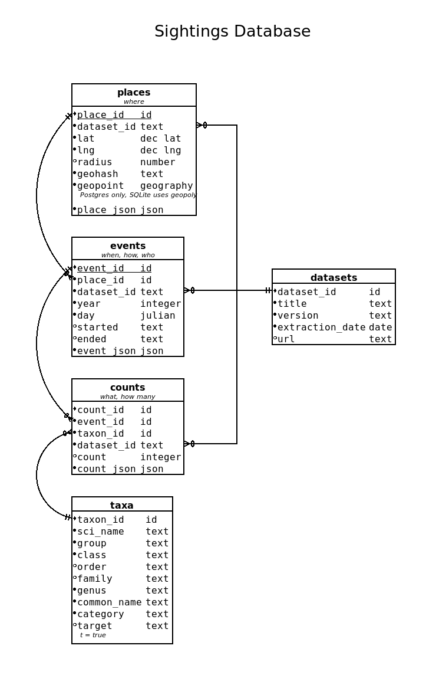

# pheno-mismatch
Causes, consequences, and cross-scale linkages of climate-driven phenological mismatch across three tropic levels

## Repository contribution
This repository contains scripts to help research and outreach efforts. There are other GitHub repositories for this project maintained by the various research labs.

## Database
All data is stored in either a SQLite3 or PostgreSQL (PostGIS) database. We have gathered and consolidated the data from the sources below. Each source dataset records different things and therefore contains very different data. Our schema distills the common information needed for our study into a relational model and keeps the unique data, for further analysis, in NoSQL JSON blobs which are attached to each relational record.

1. North American Breeding Bird Survey (BBS).
1. MAPS: Monitoring Avian Productivity and Survivorship (MAPS).
1. eBird Basic Dataset. This dataset has been culled to take everything between 20⁰ and 90⁰ latitude and -95⁰ and -50⁰ longitude. We are also only taking "complete" and "approved" checklists. Additionally, we are also only taking data for ~120 migratory bird species.
1. Pollard butterfly dataset.
1. NABA butterfly dataset.
1. Caterpillar Counts dataset.
1. NestWatch dataset.

There are 5 primary tables in the database:
1. The Taxa table that hold data specific to each taxon.
1. The Dataset table that hold information about where and when we extracted the data.
1. The Place table contains where observations occur. Most datasets sample data repeatedly at designated locations. NoSQL place data is contained in the place_json field.
1. The Event table holds when, how, and by whom data about the observation. NoSQL event data is in the event_json field.
1. The Count table holds what was observed and how many birds or leps were observed during the event. count_json holds the NoSQL data.

Some record counts for the datasets:

Dataset   | Place Records | Event Records | Count Records | Notes
--------- | ------------- | ------------- | ------------- | -----
BBS       |        5,690  |       122,925 |     6,448,898 |
MAPS      |        1,224  |       619,335 |     2,030,287 |
NestWatch |       65,063  |      503,510  |       647,212 |
Pollard   |          760  |        86,996 |        86,958 |
NABA      |        1,132  |         2,135 |       305,810 |
eBird     |    1,986,208  |    16,820,802 |   100,123,659 | Culled from 565,608,238 records

#### Samples in R
See this R [script](R/example_sql.R) for how to access the sqlite database in R.

#### Samples in Python
Most of the scripts in the lib directory access the database. I have moved common code into this [library](src/lib/db.py). A some sample_queries that use this library are in this Python [script](src/example_sql.py).

